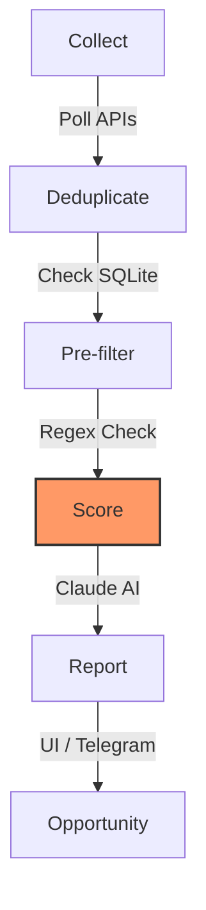

# 📡 Job Radar

Job Radar is a tool for monitoring your job search across public ATS boards (Greenhouse, Lever, Ashby, Workable). It collects, filters, and scores job listings against your profile using Claude AI, then presents the results in a web dashboard.

---

## ⚡ Features

-   **📡 Monitoring**: Polls company ATS boards concurrently.
-   **🧹 Filters**: Regex pre-filtering eliminates ~90% of noise before any scoring.
-   **🧠 AI Scoring**: Analysis of job descriptions for Match, Seniority, and Tech Stack fit.
-   **🖥️ Dashboard**: Next.js interface to manage jobs and track trends.
-   **🛰️ Aggregator**: Access to 900,000+ jobs via a remote aggregator.
-   **🎭 Profiles**: Support for multiple career profiles with separate CVs and keywords.
-   **🔔 Notifications**: Optional Telegram alerts for top matches.

---

## 🚀 Quick Start

### 1. Prerequisites

-   **Python 3.11+**
-   **Node.js 20+**
-   **Anthropic API Key** (Get one at [console.anthropic.com](https://console.anthropic.com))

### 2. One-Minute Installation

```bash
git clone <repo-url>
cd job-radar

# Install dependencies (Python venv + Node modules)
make install

# Configure your environment
cp .env.example .env
# Edit .env and paste your ANTHROPIC_API_KEY=sk-ant-...
```

### 3. Launch

```bash
make dev
```
-   **Backend**: [http://localhost:8000](http://localhost:8000) (FastAPI)
-   **Frontend**: [http://localhost:3000](http://localhost:3000) (Next.js)

On first launch the setup wizard will appear — paste your CV and click **Get Started**. Note that sensible defaults are provided for your profile configuration, and you can tune these later at any time in **Settings → Matching Rules**. Then click **Run Pipeline** to start your first scan!

---

## ⚙️ Configuration

Job Radar is highly configurable to match your specific career goals.

### 🗝️ Environment Variables (`.env`)

| Variable | Required | Purpose |
|----------|----------|---------|
| `ANTHROPIC_API_KEY` | **Yes** | Used by Claude AI to score job descriptions. |
| `TELEGRAM_BOT_TOKEN`| No | Token for Telegram notifications. |
| `TELEGRAM_CHAT_ID` | No | Your numeric Telegram ID for notification delivery. |

### 📂 Profile Configuration (`profiles/{name}/`)

Each profile is a directory containing three core files:

1.  **`profile_doc.md`**: Your CV and scoring guide for the LLM. The more specific the better — include not just your skills but explicit "Critical Skill Gaps" and "What Lowers Fit" sections to prevent score inflation on bad matches. See `profiles/example/profile_doc.md` for the full structure.
2.  **`profile.yaml`**:
    -   `keywords.title_patterns`: Split into `high_confidence` and `broad` tiers for precise filtering.
    -   `keywords.location_patterns` / `remote_patterns`: Primary location targets and a remote tier (governed by the `fallback_tier` field).
    -   `scoring`: Choose your model (e.g., `claude-haiku-4-5-20251001`) and set thresholds.
    -   `output`: Toggle reports and Telegram alerts.
3.  **`companies.yaml`**: Specific companies to monitor directly via their ATS boards, grouped by platform.

---

## 🛤️ The Pipeline

Job Radar uses a multi-stage pipeline to ensure efficiency and accuracy:



1.  **Collect**: Fetches jobs from local ATS boards or the aggregator.
2.  **Deduplicate**: Skips jobs you've already seen.
3.  **Pre-filter**: Matches against your `title_patterns` and `location_patterns`.
4.  **Score**: Sends "survivors" to Claude to compute a fit score (0-100).
5.  **Report**: Persists results and triggers notifications.

---

## 🛠️ Make Commands

| Command | Action |
|---------|--------|
| `make install` | Setup Python venv and install all dependencies. |
| `make dev` | Start the full stack (API + Web) with hot reload. |
| `make start` | Start the production build of the application. |
| `make build` | Build the frontend for production. |
| `make types` | Regenerate TypeScript types from the API spec. |
| `make clean-web`| Remove the frontend node_modules and .next cache. |
| `make clean-db`| Wipe all local databases (Danger: irreversible). |

---

## 🔒 Security & Privacy

- **Never commit `.env`** — it contains your `ANTHROPIC_API_KEY`. The `.gitignore` already excludes it, but double-check before pushing. If you accidentally expose a key, revoke it immediately at [console.anthropic.com](https://console.anthropic.com).
- **All data stays local** — job listings, scores, and your `profile_doc.md` are stored only on your machine in `data/{profile}.db`. Nothing is sent to third parties except job descriptions forwarded to the Claude API for scoring.
- **Your profile is not tracked** — `profiles/` is gitignored except for the `example/` template. Your CV (`profile_doc.md`) and company list stay private.

## 🙌 Acknowledgments

Aggregator module data sourced from [job-board-aggregator](https://github.com/Feashliaa/job-board-aggregator).

---

## ⚖️ Legal Notice

Job Radar queries the public job board APIs provided by Greenhouse, Lever, Ashby, and Workable. These endpoints are publicly documented and intended for programmatic access. Use responsibly: don't hammer endpoints, respect rate limits, and review each platform's terms of service before use.

---

## ❗ Troubleshooting

### ❌ `ANTHROPIC_API_KEY not found`
Ensure you have created a `.env` file in the root directory and that it contains `ANTHROPIC_API_KEY=your_key_here`.

### ❌ `ModuleNotFoundError`
Run `make install` again to ensure your Python virtual environment is correctly set up.

---

## 📄 License

MIT. Go find your dream job! 🚀
