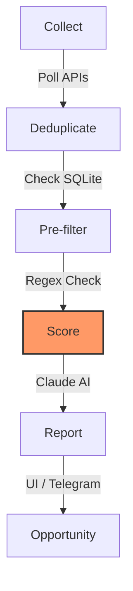

# 📡 Job Radar

Job Radar monitors your job search across curated ATS boards, public remote-job APIs, hiring feeds, and an optional large remote-job aggregator. It collects, hydrates, filters, and scores job listings against your profile using Claude, then presents the results in a web dashboard.

---

## ⚡ Features

-   **📡 Monitoring**: Scans curated ATS boards plus built-in providers like Remotive, Remote OK, Hacker News, Arbeitnow, We Work Remotely, Adzuna, and the aggregator.
-   **🧹 Filters**: Regex pre-filtering eliminates ~90% of noise before any scoring.
-   **📝 Hydration**: Fills in missing or sparse job descriptions before filtering and scoring.
-   **🧠 AI Scoring**: Analysis of job descriptions for Match, Seniority, and Tech Stack fit.
-   **🖥️ Dashboard**: Next.js interface to manage jobs and track trends.
-   **🛰️ Aggregator**: Optional broad remote-job scan alongside targeted direct sources.
-   **🎭 Profiles**: Support for multiple career profiles with separate CVs and keywords.
-   **🛠️ Import Tooling**: Generate mergeable `companies.yaml` fragments from external JSON datasets.
-   **🔔 Notifications**: Optional Telegram alerts for top matches.

---

## 🚀 Quick Start

### Docker First

If you just want to try the app, you do not need a local Python or Node install:

```bash
docker compose up --build
```

-   **Backend**: [http://localhost:8000](http://localhost:8000)
-   **Frontend**: [http://localhost:3000](http://localhost:3000)

If you want AI scoring, create a `.env` file first so the API can see your Anthropic key:

```bash
cp .env.example .env
# Edit .env and set ANTHROPIC_API_KEY=sk-ant-...
docker compose up --build
```

On Linux, if you want files in `data/` and `reports/` to stay owned by your host user instead of `root`, also add your UID/GID to `.env`:

```bash
echo "HOST_UID=$(id -u)" >> .env
echo "HOST_GID=$(id -g)" >> .env
docker compose up --build
```

On Windows, Docker Desktop is the recommended path. The compose setup enables polling-based file watching for both Next.js and FastAPI so hot reload is more reliable on bind mounts, especially when the repo lives outside WSL.

When running via Docker Compose, the API stores SQLite databases in a Docker named volume mounted at `/app/data` instead of the host `./data` directory. This keeps the code bind-mounted for hot reload, but avoids the severe SQLite write slowdown that can happen on macOS bind mounts. As a result, deleting `data/*.db` on the host does not reset the Docker-backed database; use `make clean-db` or `make clean-db-volume` instead.

### 1. Prerequisites

-   **Python 3.11+**
-   **Node.js 20+**
-   **Anthropic API Key** (Get one at [console.anthropic.com](https://console.anthropic.com))

### 2. One-Minute Installation

```bash
git clone <repo-url>
cd job-radar

# Install dependencies (Python venv + Node modules)
make install

# Configure your environment
cp .env.example .env
# Edit .env and paste your ANTHROPIC_API_KEY=sk-ant-...
```

### 3. Launch

```bash
make dev
```
-   **Backend**: [http://localhost:8000](http://localhost:8000) (FastAPI)
-   **Frontend**: [http://localhost:3000](http://localhost:3000) (Next.js)

On first launch the setup wizard appears automatically. The guided flow uploads your CV, runs AI CV analysis, lets you review extracted facts, set location and preference constraints, and then generates both `profile_doc.md` and `search_config.yaml` before you save the profile and run your first scan.

Later, you can reopen the same guided workflow from **Settings → Guided Edit** to either:
- update saved preferences and regenerate the profile from structured state
- upload a new CV and rebuild the profile from the beginning

If you prefer direct editing, **Settings** still exposes the raw `profile_doc.md`, `search_config.yaml`, and `scoring_philosophy.md` files.

---

## ⚙️ Configuration

Job Radar is highly configurable to match your specific career goals.

### 🗝️ Environment Variables (`.env`)

| Variable | Required | Purpose |
|----------|----------|---------|
| `ANTHROPIC_API_KEY` | **Yes** | Used by Claude AI to score job descriptions. |
| `TELEGRAM_BOT_TOKEN`| No | Token for Telegram notifications. |
| `TELEGRAM_CHAT_ID` | No | Your numeric Telegram ID for notification delivery. |
| `ADZUNA_APP_ID` | No | Required only if you enable the Adzuna provider. |
| `ADZUNA_APP_KEY` | No | Required only if you enable the Adzuna provider. |

### 📂 Profile Configuration (`profiles/{name}/`)

Each profile is a directory containing four main editable files:

1.  **`profile_doc.md`**: Your CV and scoring guide for the LLM. The more specific the better — include not just your skills but explicit "Critical Skill Gaps" and "What Lowers Fit" sections to prevent score inflation on bad matches. See `profiles/example/profile_doc.md` for the full structure.
2.  **`search_config.yaml`**:
    -   `keywords.title_patterns`: Split into `high_confidence` and `broad` tiers for precise filtering.
    -   `keywords.location_patterns` / `remote_patterns`: Primary location targets and a remote tier (governed by the `fallback_tier` field).
    -   `scoring`: Choose your model (e.g., `claude-haiku-4-5-20251001`) and set thresholds.
    -   `output`: Toggle reports and Telegram alerts.
3.  **`scoring_philosophy.md`**: The per-profile scoring rubric used by the LLM after pre-filtering. This is editable from **Settings**.
4.  **`companies.yaml`**: Specific companies to monitor directly via their ATS boards, grouped by platform.

The guided wizard also persists structured state alongside those files:
- `cv_analysis.json`: normalized CV extraction and derived signals
- `preferences.json`: saved wizard inputs used by guided edit and start-fresh flows

### 🔌 Providers

Registered providers currently include:

-   `aggregator`
-   `local`
-   `remotive`
-   `remoteok`
-   `hackernews`
-   `arbeitnow`
-   `weworkremotely`
-   `adzuna`

CLI examples:

```bash
# Default broad run
.venv/bin/python -m src.main --source aggregator local

# Direct ATS scan in conservative mode
.venv/bin/python -m src.main --source local --slow --dry-run

# Single-provider validation
.venv/bin/python -m src.main --source arbeitnow --dry-run -v
```

To grow `companies.yaml` from an external JSON dataset:

```bash
.venv/bin/python scripts/import_companies.py --input companies.json
```

---

## 🛤️ The Pipeline

Job Radar uses a multi-stage pipeline to ensure efficiency and accuracy:



1.  **Collect**: Fetches jobs from one or more providers such as `local`, `aggregator`, `remotive`, or `arbeitnow`.
2.  **Deduplicate**: Skips jobs you've already seen.
3.  **Hydrate**: Fetches fuller descriptions for jobs with missing or sparse text.
4.  **Pre-filter**: Matches against your `title_patterns` and `location_patterns`.
5.  **Score**: Sends survivors to Claude to compute a fit score (0-100).
6.  **Report**: Persists results and triggers notifications.

---

## 🛠️ Make Commands

| Command | Action |
|---------|--------|
| `make install` | Setup Python venv and install all dependencies. |
| `make dev` | Start the full stack (API + Web) with hot reload. |
| `make start` | Start the production build of the application. |
| `make build` | Build the frontend for production. |
| `make types` | Regenerate TypeScript types from the API spec. |
| `make test` | Run the Python test suite. |
| `make clean-web`| Remove the frontend node_modules and .next cache. |
| `make clean-db`| Wipe local databases and, if Docker is running, remove `/app/data/*.db` inside the API container. |
| `make clean-db-volume`| Remove the Docker named volume used for API SQLite databases. |

---

## 🔒 Security & Privacy

- **Never commit `.env`** — it contains your `ANTHROPIC_API_KEY`. The `.gitignore` already excludes it, but double-check before pushing. If you accidentally expose a key, revoke it immediately at [console.anthropic.com](https://console.anthropic.com).
- **All data stays local** — job listings, scores, and your `profile_doc.md` are stored only on your machine. Native runs use `data/{profile}.db`; Docker Compose runs keep SQLite databases in the Docker API volume mounted at `/app/data`. Nothing is sent to third parties except job descriptions forwarded to the Claude API for scoring.
- **Your profile is not tracked** — `profiles/` is gitignored except for the `example/` template. Your CV (`profile_doc.md`) and company list stay private.

## 🙌 Acknowledgments

Aggregator module data sourced from [job-board-aggregator](https://github.com/Feashliaa/job-board-aggregator).
Remotive source data provided by [Remotive](https://remotive.com).
Remote OK source data provided by [Remote OK](https://remoteok.com).
Hacker News source data provided by [Hacker News](https://news.ycombinator.com) via [Algolia](https://hn.algolia.com).
Arbeitnow source data provided by [Arbeitnow](https://www.arbeitnow.com).
We Work Remotely source data provided by [We Work Remotely](https://weworkremotely.com).
Adzuna source data provided by [Adzuna](https://www.adzuna.com).
Company discovery imports may include normalized ATS company data derived from [Remotebear](https://github.com/remotebear-io/remotebear) and [Awesome Easy Apply](https://github.com/sample-resume/awesome-easy-apply).

---

## ⚖️ Legal Notice

Job Radar uses a mix of direct ATS APIs, public job feeds, and optional third-party datasets. Use providers responsibly: respect rate limits, avoid aggressive scraping, and review each source's terms before enabling it in your workflow. `--slow` is available for more conservative ATS runs, and some providers such as Adzuna require their own API credentials.

---

## ❗ Troubleshooting

### ❌ `ANTHROPIC_API_KEY not found`
Ensure you have created a `.env` file in the root directory and that it contains `ANTHROPIC_API_KEY=your_key_here`.

### ❌ `ModuleNotFoundError`
Run `make install` again to ensure your Python virtual environment is correctly set up.

---

## 📄 License

Licensed under AGPL-3.0. See `LICENSE`.
